<h3><code>felipe@github ~ $ ./contributions.sh</code></h3>

 
 

<h3><code>felipe@github ~ $ whoami</code></h3>

<table>
<tr>
<td valign="top"></td>
<td valign="top"></td>
</tr>
</table>

 
 

<h3><code>felipe@github ~ $ ./links.sh</code></h3>

Construo projetos e operações com IA. Mostro decisões, testes e o que funcionou de verdade.

<a href="https://github.com/felipenalves/Dokke">Dokke</a> ·
<a href="https://github.com/felipenalves/invos">INVOS</a> ·
<a href="https://documenteclub.vercel.app">Documente.club</a> ·
<a href="https://inovadigitalid.com">Site</a> ·
<a href="https://x.com/felipenalvesinv">X</a>

